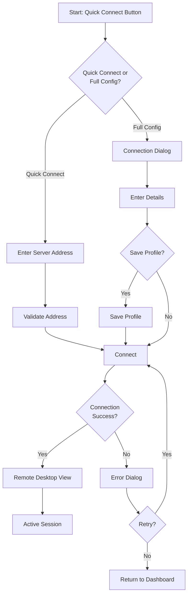

# Aivana_RDP_WPF UX Design Specification

_Created on 2025-11-26T16:23:21.309Z by BMad_
_Generated using BMad Method - Create UX Design Workflow v1.0_

---

## Executive Summary

Aivana_RDP_WPF is a modern Windows desktop application that transforms the Remote Desktop Protocol client experience through exceptional user interface design and intuitive user experience patterns. Built with WPF and Fluent Design principles, the application provides a native Windows 11 experience that feels both powerful and approachable.

**Core Vision:**
Transform RDP from a basic connectivity tool into a comprehensive remote desktop management platform with a delightful, modern interface that IT professionals and power users will love to use daily.

**Target Users:**
- IT Administrators managing multiple servers
- Developers accessing remote development environments
- Power Users who need advanced RDP features
- Enterprise Teams requiring secure, auditable remote access

**Desired Emotional Response:**
Users should feel **empowered, efficient, and in control**. The interface should communicate professionalism and reliability while remaining approachable. Users should experience delight when discovering features that save time and reduce friction.

**Core Experience:**
The defining experience is **effortless multi-connection management** - users can quickly connect to multiple remote desktops, monitor their status, transfer files seamlessly, and switch between sessions without friction. The interface makes complex remote desktop operations feel simple and intuitive.

---

## 1. Design System Foundation

### 1.1 Design System Choice

**Selected Design System:** Fluent Design System (Windows Native)

**Rationale:**
- Native Windows application built with WPF
- Fluent Design is the official Microsoft design language for Windows 11
- Provides consistency with Windows 11 system apps
- Built-in accessibility and theming support
- Optimal performance and integration with Windows APIs

**Design System Components Provided:**
- Navigation patterns (NavigationView, NavigationViewItem)
- Command controls (Button, ToggleButton, SplitButton)
- Input controls (TextBox, PasswordBox, ComboBox, CheckBox, RadioButton, Slider)
- Display controls (ListView, GridView, TreeView, DataGrid)
- Feedback controls (ProgressBar, ProgressRing, InfoBar, ToolTip)
- Content controls (Card, Expander, ContentDialog)
- Layout panels (Grid, StackPanel, RelativePanel, AdaptivePanel)

**Custom Components Required:**
- Connection Card Component (displays connection status, health metrics, quick actions)
- Multi-Connection Dashboard (grid/list view of active connections with status indicators)
- File Transfer Progress Component (drag-and-drop zone with transfer queue)
- Performance Monitor Widget (real-time metrics visualization)
- Session Recording Controls (record button with status and quality settings)

**Components Requiring Heavy Customization:**
- NavigationView: Custom styling for connection groups and favorites
- ListView/GridView: Custom item templates for connection cards
- ContentDialog: Custom layouts for connection configuration
- ProgressBar: Custom styling for file transfer progress with pause/resume

**Version:** Fluent Design System 2.0 (Windows 11)
**Documentation:** Microsoft Fluent Design Guidelines

---

## 2. Core User Experience

### 2.1 Defining Experience

**The Defining Experience:** "Effortless Multi-Connection Management"

When someone describes Aivana_RDP_WPF, they would say: "It's the RDP client where you can manage all your remote connections in one beautiful interface, transfer files with drag-and-drop, and never lose your place."

**Core Interaction Pattern:**
The application uses a **master-detail pattern** with a sidebar navigation showing all saved connections (organized by groups/favorites) and a main content area showing either:
- Connection dashboard (when no connection selected)
- Active remote desktop session (when connected)
- Connection configuration (when editing)

**Primary User Actions:**
1. **Quick Connect** - One-click connection to favorite servers
2. **Multi-Session Management** - View and switch between multiple active connections
3. **Seamless File Transfer** - Drag-and-drop files between local and remote
4. **Performance Monitoring** - Real-time visibility into connection health

**Experience Principles:**

**Speed:** Key actions (connect, disconnect, switch sessions) should feel instant. Connection establishment should provide immediate feedback. File transfers should start immediately upon drag-and-drop.

**Guidance:** First-time users should discover features naturally through the interface. Power users should have quick access to advanced features without clutter. Contextual help available but not intrusive.

**Flexibility:** Users can customize layouts, organize connections their way, and configure workflows. Advanced features are available but don't overwhelm basic users.

**Feedback:** Clear visual feedback for all actions. Connection status always visible. File transfer progress always clear. Performance metrics provide transparency.

### 2.2 Novel UX Patterns

**No novel patterns detected** - Standard desktop application patterns apply with Fluent Design enhancements.

The application leverages established patterns:
- Master-detail navigation (sidebar + main content)
- Tab-based multi-session management
- Drag-and-drop file transfer
- Real-time status indicators
- Contextual action menus

---

## 3. Visual Foundation

### 3.1 Color System

**Selected Theme:** Professional Blue (Fluent Design inspired)

**Color Palette:**

**Primary Colors:**
- Primary: `#0078D4` (Fluent Blue) - Main actions, active states, key UI elements
- Primary Dark: `#005A9E` - Hover states, pressed states
- Primary Light: `#40A6FF` - Subtle highlights, disabled states

**Secondary Colors:**
- Secondary: `#6B6B6B` (Neutral Gray) - Secondary actions, supporting elements
- Accent: `#00BCF2` (Cyan) - File transfer, notifications, highlights

**Semantic Colors:**
- Success: `#107C10` (Green) - Successful connections, completed transfers
- Warning: `#FFB900` (Amber) - Connection warnings, performance alerts
- Error: `#D13438` (Red) - Connection failures, errors
- Info: `#0078D4` (Blue) - Informational messages

**Neutral Grayscale:**
- Background: `#F3F3F3` (Light mode) / `#202020` (Dark mode)
- Surface: `#FFFFFF` (Light mode) / `#2D2D2D` (Dark mode)
- Border: `#E1E1E1` (Light mode) / `#404040` (Dark mode)
- Text Primary: `#000000` (Light mode) / `#FFFFFF` (Dark mode)
- Text Secondary: `#6B6B6B` (Light mode) / `#A0A0A0` (Dark mode)
- Text Disabled: `#A0A0A0` (Light mode) / `#606060` (Dark mode)

**Connection Status Colors:**
- Connected: `#107C10` (Green)
- Connecting: `#FFB900` (Amber)
- Disconnected: `#6B6B6B` (Gray)
- Error: `#D13438` (Red)

**Theme Personality:**
- **Professional & Trustworthy** - Blue conveys reliability and professionalism
- **Modern & Clean** - Fluent Design aesthetic feels contemporary
- **Accessible** - High contrast ratios ensure readability
- **Consistent** - Aligns with Windows 11 system apps

**Dark Mode Support:**
Full dark mode implementation with Fluent Design dark theme colors. Automatic switching based on Windows system preference with manual override option.

**Interactive Visualizations:**
- Color Theme Explorer: [ux-color-themes.html](./ux-color-themes.html)

### 3.2 Typography

**Font Families:**
- **Headings:** Segoe UI Variable Display (Windows 11 system font)
- **Body:** Segoe UI Variable Text (Windows 11 system font)
- **Monospace:** Cascadia Code (for connection details, terminal output)

**Type Scale:**
- **H1 (Page Title):** 28px / 1.2 line-height / Semibold (600)
- **H2 (Section Title):** 20px / 1.3 line-height / Semibold (600)
- **H3 (Subsection):** 16px / 1.4 line-height / Semibold (600)
- **Body Large:** 14px / 1.5 line-height / Regular (400)
- **Body:** 13px / 1.5 line-height / Regular (400)
- **Body Small:** 12px / 1.4 line-height / Regular (400)
- **Caption:** 11px / 1.3 line-height / Regular (400)

**Font Weights:**
- Regular (400): Body text, descriptions
- Semibold (600): Headings, labels, emphasis
- Bold (700): Critical information, warnings

**Usage Guidelines:**
- Headings use Semibold weight for hierarchy
- Body text uses Regular weight for readability
- Connection names use Semibold for quick scanning
- Status text uses Regular with color for emphasis

### 3.3 Spacing and Layout

**Base Unit:** 4px spacing system

**Spacing Scale:**
- XS: 4px
- SM: 8px
- MD: 12px
- LG: 16px
- XL: 24px
- 2XL: 32px
- 3XL: 48px
- 4XL: 64px

**Layout Grid:**
- **Desktop:** 12-column grid with 16px gutters
- **Minimum Width:** 1024px (ensures sidebar + content fit comfortably)
- **Sidebar Width:** 280px (fixed, collapsible to 48px icon-only)
- **Content Area:** Flexible, minimum 720px width

**Container Widths:**
- **Full Width:** 100% of content area
- **Content Max:** 1400px (centered for readability)
- **Dialog Max:** 600px (modals and dialogs)

**Breakpoints:**
- **Small Desktop:** 1024px - 1280px (sidebar + single column content)
- **Medium Desktop:** 1280px - 1920px (sidebar + multi-column layouts)
- **Large Desktop:** 1920px+ (optimized spacing, larger content areas)

---

## 4. Design Direction

### 4.1 Chosen Design Approach

**Selected Direction:** "Spacious Professional Dashboard"

**Design Philosophy:**
A clean, professional interface that prioritizes clarity and efficiency. The layout uses generous white space to reduce cognitive load while maintaining information density through smart organization. Visual hierarchy guides users naturally through workflows.

**Layout Approach:**
- **Navigation:** Left sidebar with connection groups, favorites, and recent connections
- **Content Structure:** Single-column main content with card-based organization
- **Content Organization:** Card-based layout for connections, dashboard widgets, and settings

**Visual Hierarchy:**
- **Density:** Balanced - Information-rich but with breathing room
- **Header Emphasis:** Subtle but clear section headers
- **Content Focus:** Data-driven with clear visual indicators

**Interaction Patterns:**
- **Primary Actions:** Dedicated action buttons with clear hierarchy
- **Information Disclosure:** Progressive disclosure for advanced settings
- **User Control:** Flexible layouts with customization options

**Visual Style:**
- **Weight:** Balanced - Clear structure with moderate visual weight
- **Depth Cues:** Subtle elevation with Fluent Design acrylic effects
- **Border Style:** Subtle borders with rounded corners (4px radius)

**Key Characteristics:**
- **Layout:** Sidebar navigation + main content area
- **Density:** Balanced information density
- **Navigation:** Hierarchical sidebar with groups and favorites
- **Primary Action Prominence:** High - Quick Connect button always visible

**Rationale:**
This direction balances professional appearance with usability. The sidebar navigation provides quick access to all connections while the main content area adapts to show connection details, active sessions, or dashboard views. The card-based organization makes it easy to scan and manage multiple connections.

**User Notes:**
- Clean and professional appearance
- Easy to scan connection list
- Clear visual hierarchy
- Feels native to Windows 11

**Interactive Mockups:**
- Design Direction Showcase: [ux-design-directions.html](./ux-design-directions.html)

---

## 5. User Journey Flows

### 5.1 Critical User Paths

#### Journey 1: First-Time Connection Setup

**User Goal:** Connect to a remote desktop for the first time

**Flow Approach:** Guided wizard with progressive disclosure

**Flow Steps:**

1. **Entry Point - Quick Connect Dialog**
   - User sees: Quick Connect button in toolbar, or "New Connection" option
   - User does: Clicks "New Connection" or enters server address in Quick Connect
   - System responds: Opens connection configuration dialog

2. **Connection Configuration Screen**
   - User sees: Form with server address, username, display name fields
   - User does: Enters connection details
   - System responds: Real-time validation, suggests saved credentials if available

3. **Advanced Settings (Collapsed by Default)**
   - User sees: "Advanced Settings" expandable section
   - User does: Expands if needed to configure resolution, color depth, etc.
   - System responds: Shows advanced options with helpful tooltips

4. **Save Profile (Optional)**
   - User sees: "Save connection profile" checkbox
   - User does: Checks to save, optionally adds to favorites
   - System responds: Prompts for profile name and group assignment

5. **Connection Establishment**
   - User sees: Connection progress indicator with status messages
   - User does: Waits for connection
   - System responds: Shows connection progress, establishes RDP session

6. **Success State**
   - Completion feedback: Remote desktop appears in main content area, connection card shows "Connected" status
   - Next action: User can interact with remote desktop, or open additional connections

**Decision Points:**
- Quick Connect vs Full Configuration: Quick Connect for simple connections, Full Configuration for advanced settings
- Save Profile: User chooses whether to save for future use

**Error States:**
- Invalid server address: Inline error message with suggestions
- Connection timeout: Error dialog with retry option and troubleshooting tips
- Authentication failure: Clear error message with credential reset option

**Mermaid Flow Diagram:**

#### Journey 2: Multi-Connection Management

**User Goal:** Connect to multiple servers and switch between them efficiently

**Flow Approach:** Tab-based multi-session management

**Flow Steps:**

1. **Entry Point - Connection Dashboard**
   - User sees: List of saved connections with status indicators
   - User does: Clicks on connection card or uses Quick Connect
   - System responds: Opens new connection tab

2. **Active Session Tab**
   - User sees: Remote desktop session in tabbed interface
   - User does: Interacts with remote desktop
   - System responds: Updates tab title with connection name, shows connection status

3. **Switch Between Sessions**
   - User sees: Multiple tabs at top of content area
   - User does: Clicks different tab to switch
   - System responds: Instantly switches to selected session, maintains session state

4. **Session Management Actions**
   - User sees: Tab context menu with options (Disconnect, Reconnect, Settings)
   - User does: Selects action from menu
   - System responds: Performs action, updates UI accordingly

**Decision Points:**
- Tab Limit: Maximum 10 simultaneous connections (configurable)
- Tab Organization: Tabs show connection name and status indicator

**Error States:**
- Connection dropped: Tab shows error indicator, offers reconnect button
- Too many connections: Dialog suggests closing inactive sessions

#### Journey 3: File Transfer via Drag-and-Drop

**User Goal:** Transfer files between local machine and remote desktop seamlessly

**Flow Approach:** Direct manipulation with visual feedback

**Flow Steps:**

1. **Entry Point - Active Session**
   - User sees: Remote desktop session displayed
   - User does: Drags file from Windows Explorer onto remote desktop window
   - System responds: Shows drop zone overlay with transfer preview

2. **File Transfer Initiation**
   - User sees: Drop zone highlights, shows file count and total size
   - User does: Releases mouse button to drop files
   - System responds: Starts file transfer, shows progress indicator

3. **Transfer Progress**
   - User sees: Transfer queue panel with individual file progress bars
   - User does: Can pause/resume individual transfers or view details
   - System responds: Updates progress in real-time, shows transfer speed

4. **Completion**
   - User sees: Success notification, files appear in remote location
   - User does: Continues working or initiates another transfer
   - System responds: Transfer queue updates, history recorded

**Decision Points:**
- Transfer Direction: System detects drag direction (local→remote or remote→local)
- Overwrite Behavior: Prompts if file exists (configurable)

**Error States:**
- Insufficient permissions: Clear error message with guidance
- Network interruption: Automatic retry with resume capability
- File too large: Warning with option to proceed or cancel

---

## 6. Component Library

### 6.1 Component Strategy

**From Fluent Design System:**
- NavigationView (sidebar navigation)
- Button, ToggleButton, SplitButton (actions)
- TextBox, PasswordBox, ComboBox (inputs)
- ListView, GridView (connection lists)
- Card (connection cards, dashboard widgets)
- ProgressBar, ProgressRing (loading states)
- InfoBar (notifications, alerts)
- ContentDialog (modals, dialogs)
- ToolTip (help text, hints)

**Custom Components Needed:**

#### Connection Card Component
**Purpose:** Display connection information, status, and quick actions in a scannable card format

**Anatomy:**
- Header: Connection name, favorite indicator, status badge
- Body: Server address, last connected time, connection health indicator
- Footer: Quick actions (Connect, Edit, Delete)

**States:**
- Default: Shows saved connection details
- Hover: Highlights card, shows action buttons
- Selected: Border highlight, active connection indicator
- Loading: Shows connection progress spinner
- Error: Red border, error message
- Disabled: Grayed out, no interactions

**Variants:**
- Compact: Minimal information for list views
- Detailed: Full information with health metrics
- Active: Shows when connection is currently active

**Behavior:**
- Click: Opens connection or switches to active session
- Right-click: Context menu with actions
- Drag: Reorder in connection list

**Accessibility:**
- ARIA role: `button` or `listitem`
- Keyboard navigation: Arrow keys to navigate, Enter to activate
- Screen reader: Announces connection name, status, and available actions

#### Multi-Connection Dashboard Component
**Purpose:** Display and manage multiple active connections simultaneously

**Anatomy:**
- Tab Bar: Shows all active connections with status indicators
- Content Area: Displays selected connection's remote desktop
- Status Bar: Shows connection health metrics for active session

**States:**
- Single Connection: Full-width content area
- Multiple Connections: Tabbed interface
- No Connections: Empty state with Quick Connect prompt

**Variants:**
- Grid View: Thumbnail grid of all active sessions (preview mode)
- Tab View: Standard tabbed interface (default)

**Behavior:**
- Tab Click: Switches to selected connection
- Tab Close: Disconnects and closes session
- Tab Drag: Reorders tabs

**Accessibility:**
- ARIA role: `tablist` with `tab` and `tabpanel` roles
- Keyboard navigation: Ctrl+Tab to switch, Ctrl+W to close
- Screen reader: Announces active tab and connection status

#### File Transfer Progress Component
**Purpose:** Display file transfer queue with individual progress indicators

**Anatomy:**
- Transfer Queue List: Individual file transfer items
- Each Item: File name, progress bar, speed, time remaining, pause/resume button
- Summary: Total progress, overall speed, estimated time

**States:**
- Queued: Waiting to start
- Transferring: Active progress bar
- Paused: Paused indicator, resume button
- Completed: Success checkmark, fade out after delay
- Error: Error icon, retry button

**Variants:**
- Compact: Minimal information in notification
- Detailed: Full panel with all transfer details
- Minimized: Collapsed to system tray icon

**Behavior:**
- Drag-and-Drop: Initiates transfer
- Pause/Resume: Individual file control
- Cancel: Removes from queue
- Auto-dismiss: Completed transfers fade after 5 seconds

**Accessibility:**
- ARIA role: `region` with `progressbar` roles
- Keyboard navigation: Tab through transfers, Space to pause/resume
- Screen reader: Announces transfer progress updates

#### Performance Monitor Widget
**Purpose:** Real-time visualization of connection performance metrics

**Anatomy:**
- Metrics Display: Bandwidth, latency, frame rate, packet loss
- Visual Indicators: Color-coded status (green/yellow/red)
- Mini Graph: Historical trend visualization

**States:**
- Collapsed: Icon-only with status color
- Expanded: Full metrics display with graphs
- Alert: Highlights when metrics exceed thresholds

**Variants:**
- Dashboard Widget: Large display in dashboard view
- Status Bar: Compact display in connection tab
- Floating Panel: Detachable floating window

**Behavior:**
- Click: Expands/collapses widget
- Hover: Shows detailed tooltip
- Auto-alert: Notifies when performance degrades

**Accessibility:**
- ARIA role: `region` with `status` role
- Keyboard navigation: Enter to expand/collapse
- Screen reader: Announces current metrics and status

---

## 7. UX Pattern Decisions

### 7.1 Consistency Rules

#### Button Hierarchy

**Primary Action:** 
- Style: Fluent Design AccentButtonStyle - Blue background (`#0078D4`), white text
- Usage: Main action on screen (Connect, Save, Transfer)
- Placement: Prominent position, typically top-right or bottom-right

**Secondary Action:**
- Style: Fluent Design DefaultButtonStyle - Transparent background, blue text border
- Usage: Alternative actions (Cancel, Edit, Configure)
- Placement: Adjacent to primary action or in toolbar

**Tertiary Action:**
- Style: Fluent Design SubtleButtonStyle - Minimal styling, text-only
- Usage: Less common actions (Help, Advanced Options)
- Placement: Secondary locations, menus

**Destructive Action:**
- Style: Red text (`#D13438`) with warning icon
- Usage: Delete, Disconnect, Remove actions
- Placement: Context menus, confirmation dialogs

#### Feedback Patterns

**Success:**
- Pattern: InfoBar with success style (green background, checkmark icon)
- Duration: Auto-dismiss after 3 seconds
- Placement: Top of content area, non-blocking

**Error:**
- Pattern: InfoBar with error style (red background, error icon) + ContentDialog for critical errors
- Duration: Manual dismiss or auto-dismiss after 5 seconds
- Placement: Top of content area, blocking dialog for critical errors

**Warning:**
- Pattern: InfoBar with warning style (amber background, warning icon)
- Duration: Manual dismiss
- Placement: Top of content area

**Info:**
- Pattern: InfoBar with info style (blue background, info icon)
- Duration: Auto-dismiss after 4 seconds
- Placement: Top of content area

**Loading:**
- Pattern: ProgressRing for indeterminate, ProgressBar for determinate progress
- Usage: Connection establishment, file transfers, long operations
- Placement: Inline with content or centered in loading area

#### Form Patterns

**Label Position:** Above input fields (Fluent Design standard)
**Required Field Indicator:** Asterisk (*) after label text
**Validation Timing:** OnBlur (when field loses focus) + onSubmit
**Error Display:** Inline error message below field + summary at top if multiple errors
**Help Text:** Tooltip on info icon next to label

#### Modal Patterns

**Size Variants:**
- Small: 400px width (confirmations, simple forms)
- Medium: 600px width (connection configuration, settings)
- Large: 800px width (complex wizards, detailed views)

**Dismiss Behavior:** Click outside to dismiss (non-destructive), Escape key always closes
**Focus Management:** Auto-focus first input field, trap focus within modal
**Stacking:** Only one modal at a time, previous modal dimmed behind

#### Navigation Patterns

**Active State Indication:** Accent color underline + background highlight in sidebar
**Breadcrumb Usage:** Not used (sidebar navigation provides context)
**Back Button Behavior:** Browser-style back (if applicable) + app navigation back button
**Deep Linking:** Supported for connection profiles (open specific connection from external link)

#### Empty State Patterns

**First Use:**
- Guidance: Welcome message with "Create First Connection" CTA
- Visual: Illustration or icon
- CTA: Prominent "New Connection" button

**No Results:**
- Message: "No connections found" with search/filter suggestions
- Visual: Empty state icon
- Actions: "Create Connection" or "Clear Filters"

**Cleared Content:**
- Message: "No active connections" with Quick Connect option
- Visual: Empty state icon
- Undo: Not applicable (connections are saved)

#### Confirmation Patterns

**Delete:**
- Pattern: ContentDialog with destructive action button
- Always confirm: Yes (prevents accidental deletion)
- Undo: Not available (permanent action)

**Leave Unsaved:**
- Pattern: ContentDialog warning about unsaved changes
- Options: Save, Discard, Cancel
- Auto-save: Optional (saves drafts automatically)

**Irreversible Actions:**
- Pattern: ContentDialog with clear warning message
- Confirmation Level: Explicit confirmation required
- Examples: Delete connection, Clear history, Reset settings

#### Notification Patterns

**Placement:** Top-right corner, stacked vertically
**Duration:** 
- Success: 3 seconds auto-dismiss
- Info: 4 seconds auto-dismiss
- Warning: Manual dismiss
- Error: 5 seconds auto-dismiss or manual dismiss

**Stacking:** Maximum 3 notifications visible, older ones auto-dismiss
**Priority Levels:**
- Critical: Blocking dialog (connection failures)
- Important: Persistent notification (security alerts)
- Info: Auto-dismiss notification (transfer complete)

#### Search Patterns

**Trigger:** Manual (search icon in toolbar)
**Results Display:** Instant results as user types, filtered connection list
**Filters:** Advanced filter panel accessible from search bar
**No Results:** "No connections match your search" with suggestions

#### Date/Time Patterns

**Format:** Relative for recent (< 24 hours), absolute for older
- Examples: "2 minutes ago", "Yesterday", "Nov 15, 2024"
**Timezone Handling:** User's local timezone (Windows system setting)
**Pickers:** Fluent Design CalendarDatePicker for date selection

---

## 8. Responsive Design & Accessibility

### 8.1 Responsive Strategy

**Target Devices:**
- Desktop: Primary platform (Windows 10/11)
- Tablet: Touch-optimized for Windows tablets (Surface Pro, etc.)
- Minimum Width: 1024px (ensures sidebar + content fit)

**Breakpoint Strategy:**

**Desktop (1024px+):**
- Layout: Sidebar navigation (280px) + flexible content area
- Navigation: Full sidebar with labels
- Content: Multi-column layouts where appropriate
- Tables: Full table view with horizontal scroll if needed

**Tablet (768px - 1023px):**
- Layout: Collapsible sidebar (icon-only when collapsed)
- Navigation: Sidebar collapses to 48px icon-only mode
- Content: Single column, touch-optimized spacing
- Touch Targets: Minimum 44x44px for all interactive elements

**Adaptation Patterns:**

**Navigation:**
- Desktop: Full sidebar always visible
- Tablet: Sidebar collapses to icon-only, expands on hover/click
- Mobile: Hamburger menu (if mobile support added)

**Sidebar:**
- Desktop: 280px fixed width
- Tablet: Collapses to 48px icon-only, expands on interaction
- Touch: Swipe gesture to show/hide sidebar

**Cards/Lists:**
- Desktop: Grid layout (2-3 columns) for connection cards
- Tablet: Single column list view
- Touch: Larger touch targets, swipe gestures for actions

**Tables:**
- Desktop: Full table with all columns
- Tablet: Card view with key information, expand for details
- Touch: Swipe to reveal actions

**Modals:**
- Desktop: Centered modal (400-800px width)
- Tablet: Full-screen modal on small screens
- Touch: Larger touch targets, swipe to dismiss

**Forms:**
- Desktop: Multi-column layouts where appropriate
- Tablet: Single column, stacked inputs
- Touch: Larger input fields, better spacing

### 8.2 Accessibility Strategy

**Compliance Target:** WCAG 2.1 Level AA

**Key Requirements:**

**Color Contrast:**
- Text vs Background: Minimum 4.5:1 ratio (AA standard)
- Large Text: Minimum 3:1 ratio
- Interactive Elements: Minimum 3:1 ratio for focus indicators

**Keyboard Navigation:**
- All interactive elements accessible via keyboard
- Logical tab order throughout application
- Keyboard shortcuts for common actions:
  - Ctrl+N: New Connection
  - Ctrl+F: Search
  - Ctrl+Tab: Switch between active sessions
  - Alt+F4: Close application
  - F1: Help

**Focus Indicators:**
- Visible focus rectangles on all interactive elements
- Focus color: Accent blue (`#0078D4`) with 2px outline
- Focus visible during keyboard navigation

**ARIA Labels:**
- Meaningful labels for all interactive elements
- Connection cards: "Connection to [server], Status: [status]"
- Buttons: Descriptive action labels ("Connect to server", "Delete connection")
- Status indicators: Live regions for dynamic updates

**Alt Text:**
- Descriptive alt text for all meaningful images
- Decorative images marked as decorative (empty alt)
- Icons: Text labels or ARIA labels

**Form Labels:**
- Proper label associations using `for` attribute
- Required fields clearly marked
- Error messages associated with form fields

**Error Identification:**
- Clear, descriptive error messages
- Error messages associated with form fields via ARIA
- Error summary at top of forms with multiple errors

**Touch Target Size:**
- Minimum 44x44px for all interactive elements (tablet/mobile)
- Adequate spacing between touch targets (8px minimum)

**Screen Reader Support:**
- Compatible with Windows Narrator, NVDA, JAWS
- Semantic HTML structure
- ARIA landmarks for navigation
- Live regions for dynamic content updates

**Testing Strategy:**
- Automated: Windows Accessibility Insights, axe DevTools
- Manual: Keyboard-only navigation testing
- Screen Reader: Windows Narrator testing, NVDA testing
- Color Contrast: WebAIM Contrast Checker validation

**Windows High Contrast Mode:**
- Full support for Windows High Contrast themes
- All UI elements visible and functional
- Respects system color preferences

**Text Scaling:**
- Supports Windows text scaling (up to 200%)
- Layout adapts gracefully to larger text sizes
- No horizontal scrolling at 200% text scale

---

## 9. Implementation Guidance

### 9.1 Completion Summary

**Excellent work! Your UX Design Specification is complete.**

**What we created together:**

- **Design System:** Fluent Design System 2.0 with 5 custom components
- **Visual Foundation:** Professional Blue color theme with Segoe UI Variable typography and 4px spacing system
- **Design Direction:** Spacious Professional Dashboard - Clean, professional interface with balanced information density
- **User Journeys:** 3 critical flows designed with clear navigation paths (First-Time Connection, Multi-Connection Management, File Transfer)
- **UX Patterns:** 10 consistency rule categories established for cohesive experience
- **Responsive Strategy:** 2 breakpoints (Desktop 1024px+, Tablet 768-1023px) with adaptation patterns for all device sizes
- **Accessibility:** WCAG 2.1 Level AA compliance requirements defined with comprehensive testing strategy

**Your Deliverables:**
- UX Design Document: `docs/ux-design-specification.md`
- Interactive Color Themes: `docs/ux-color-themes.html`
- Design Direction Mockups: `docs/ux-design-directions.html`

**What happens next:**
- Designers can create high-fidelity mockups from this foundation
- Developers can implement with clear UX guidance and rationale
- All your design decisions are documented with reasoning for future reference

You've made thoughtful choices through visual collaboration that will create a great user experience. Ready for design refinement and implementation!

---

## Appendix

### Related Documents

- Product Requirements: `docs/prd.md`
- Product Brief: (not created)
- Brainstorming: `docs/bmm-brainstorming-session-2025-11-26.md`

### Core Interactive Deliverables

This UX Design Specification was created through visual collaboration:

- **Color Theme Visualizer**: `docs/ux-color-themes.html`
  - Interactive HTML showing all color theme options explored
  - Live UI component examples in each theme
  - Side-by-side comparison and semantic color usage

- **Design Direction Mockups**: `docs/ux-design-directions.html`
  - Interactive HTML with 6-8 complete design approaches
  - Full-screen mockups of key screens
  - Design philosophy and rationale for each direction

### Next Steps & Follow-Up Workflows

This UX Design Specification can serve as input to:

- **Wireframe Generation Workflow** - Create detailed wireframes from user flows
- **Figma Design Workflow** - Generate Figma files via MCP integration
- **Interactive Prototype Workflow** - Build clickable HTML prototypes
- **Component Showcase Workflow** - Create interactive component library
- **AI Frontend Prompt Workflow** - Generate prompts for v0, Lovable, Bolt, etc.
- **Solution Architecture Workflow** - Define technical architecture with UX context

### Version History

| Date                      | Version | Changes                         | Author |
| ------------------------- | ------- | ------------------------------- | ------ |
| 2025-11-26T16:23:21.309Z | 1.0     | Initial UX Design Specification | BMad   |

---

_This UX Design Specification was created through collaborative design facilitation, not template generation. All decisions were made with user input and are documented with rationale._

